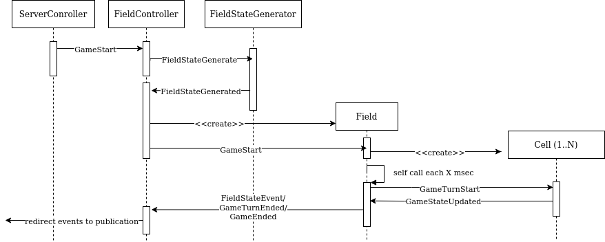

# conway-life-stream-server
A trivial implementation of Conway's Game of Life with the help of actors. Used technologies:
* Akka
* Akka Http
* Akka Streams (part of Akka itself)

Reference documentation:
* [Akka](https://doc.akka.io/docs/akka/current/)
* [Akka Http](https://doc.akka.io/docs/akka-http/current/)

After its start the application will start to publish events as an infinite HTTP-stream from endpoint `/stream` or as WebSocket-stream from `/ws`.

## Client
Could be found in another repo - [conway-life-stream-web-client](https://github.com/fedor-malyshkin/conway-life-stream-web-client)

## Compilation and run
As a build tool I user [gradle](https://gradle.org/) and `gradle-wrapper`, so you can easily compile and build 
application with `./gradlew build` and run with `./gradlew run`.

## Tests
For the tests I used [ScalaTest](https://www.scalatest.org/) and Akka native libraries. The tests can be run by the command `./gradlew scalaTest`.

## CI/CD
For integration and deployment was used GitHub's framework - GitHub Actions. Workflow source is available [there](.github/workflows/ci-cd.yml)
Active workflow could be found [there](https://github.com/fedor-malyshkin/conway-life-stream-server/actions).

## Deployment 
For deployment Kubernetes cluster from Azure was used  - the cheapest one from the cloud providers.
Nice source of info related to cloud provider price comparison - [Managed Kubernetes Price Comparison (2020)](https://devopsdirective.com/posts/2020/03/managed-kubernetes-comparison/)

Deployment descriptors are available in `deployment` sub-folder.

### Sample Azure deployment:
Create the resource group:
```sh
az group create --name conwayLifeResourceGroup --location eastus
```
Create a cluster (it could take some time):
```sh
az aks create --resource-group conwayLifeResourceGroup --name conwayLifeAKSCluster --node-count 1  --node-vm-size Standard_B2s --enable-addons monitoring --generate-ssh-keys
```

Get credentials and check functionality:
```sh
az aks get-credentials --resource-group conwayLifeResourceGroup --name conwayLifeAKSCluster
kubectl get nodes
```
Don't forget to store the credentials to future use.

Rolling update is done by command: `kubectl set image deployment/stream-server-deployment conway-life-stream-server=XXXX`

## Some implementation info
For this app used fresh enough feature of akka - typed actors (in fact not absolutely fresh,
bet has been published officially recently).

### Hierarchy of actors


### Actor interaction

